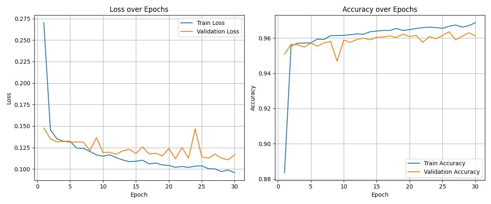
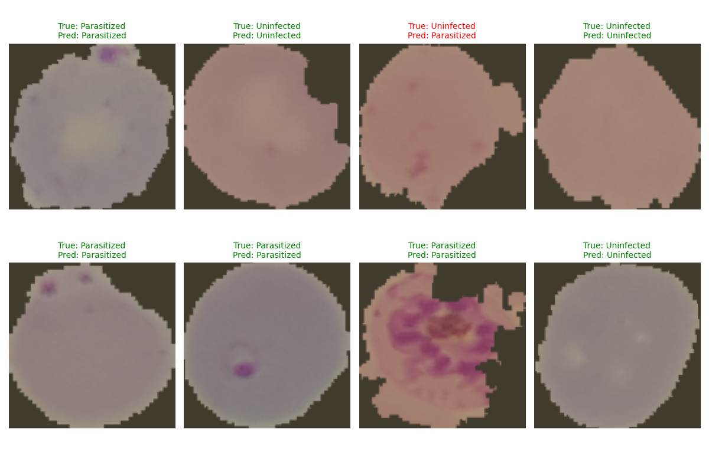

# 🦟 AI-Powered Malaria Diagnosis

A Deep Learning solution for detecting parasitized blood cells using PyTorch. This project demonstrates a modular "AI Engineering" workflow, separating model architecture, training logic, and evaluation pipelines.

## 🏗️ Project Structure
Unlike standard notebooks, this project is built as a Python package:
* `model.py`: Custom CNN architecture (PyTorch).
* `dataloading.py`: Data transformations and splitting logic.
* `training.py`: Training engine with live tqdm progress tracking.
* `evaluating.py`: Inference and validation metrics.
* `Malaria_Analysis.ipynb`: The main laboratory notebook for EDA and experiments.

## 📊 Results
* **Accuracy:** ~95%
* **Architecture:** 3-Layer Convolutional Neural Network (CNN)
* **Dataset:** NIH Malaria Cell Images





## 🚀 Usage
```python
# Train the model
from training import train_step
# (See notebook for full implementation)
```